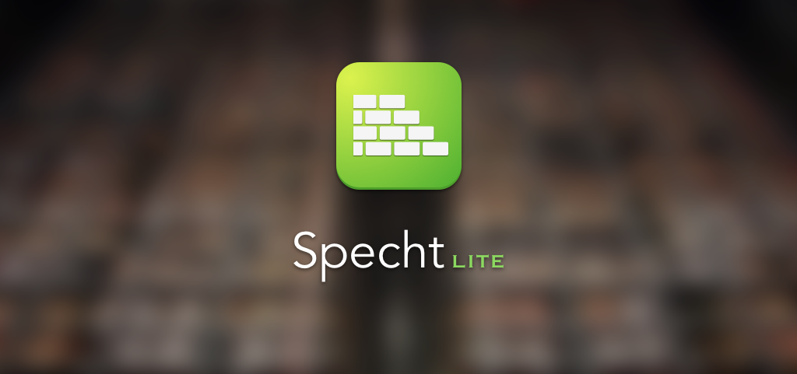
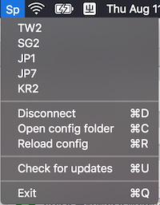

#Specht Lite
[](https://gitter.im/zhuhaow/NEKit?utm_source=badge&utm_medium=badge&utm_campaign=pr-badge&utm_content=badge) [](https://telegram.me/NEKitGroup) [](https://travis-ci.org/zhuhaow/SpechtLite) [](https://github.com/zhuhaow/SpechtLite/releases) [](LICENSE)
### A rule-based proxy app for macOS.



## Overview
SpechtLite is a simple proxy app built with [NEKit](https://github.com/zhuhaow/NEKit).



SpechtLite comes with a simple GUI that helps you switch profiles with different rule settings.

Download here. [](https://github.com/zhuhaow/SpechtLite/releases)

SpechtLite can:

* Run HTTP/SOCKS5 proxy server locally to accept requests and then
* Forward them to different remote HTTP/HTTP over SSL/SOCKS5/Shadowsocks proxy or even select them automatically by
* The geographical location, regular expressions rule or/and the speed of the connection.

The core of SpechtLite consists just a few lines of code invoking [NEKit](https://github.com/zhuhaow/NEKit). The app is provided as a demo of how NEKit works and let people test it though I thinks this app works well enough for real usage.

Note there is no fancy GUI configuration panel. But no worry, you simply need some YAML files to get everything running. 

If you do need a fancy GUI, consider some commercial alternatives such as the Mac version of [Surge](http://nssurge.com).

**[Wingy](https://itunes.apple.com/cn/app/wingy-mian-fei-banvpn-ke-hu/id1148026741?mt=8) is a free app built with NEKit available on App Store for your iDevice.** Note Wingy is not created by or affiliated with me.

["Lite"? Is there a "Full" version?](#full)


## Configuration File

[中文说明](https://github.com/zhuhaow/SpechtLite/wiki/如何配置Specht-Lite)

There is a template for Chinese users [here](https://github.com/HoonHwang/SpechtLiteConf), which is not maintained by me.

In case you do not know YAML, [read first](http://docs.ansible.com/ansible/YAMLSyntax.html).

Below is a simple demo configuration file:

```yaml
# This is the local http proxy server port.
# Note there is another SOCKS5 proxy server starts at port+1 automatically.
port: 9090
# Adapter is the remote proxy server you want to connect to
adapter:
     # id is used to distinguish adapter when defining rules.
     # There is a 'direct' adapter that connect directly to target host without proxy.
  - id: adapter1
     # HTTP server is a http proxy server.
    type: HTTP
    host: http.proxy
    port: 3128
    auth: true
    username: proxy_username
    password: proxy_password
  - id: adapter2
     # SHTTP server is a http proxy server on SSL.
    type: SHTTP
    host: http.proxy.connect.via.https
    port: 3128
    auth: true
    username: proxy_username
    password: proxy_password
  - id: adapter3
    type: ss
    host: ss.server
    port: 3128
    # Currently support: AES-128-CFB, AES-192-CFB, AES-256-CFB, chacha20, salsa20, rc4-md5
    # Shadowsocks encryption methods are not fully tested, please report if there is anything not working.
    method: AES-128-CFB
    password: ss_password
    # Currently support: origin and verify_sha1
    protocol: origin
    # Currently support: origin, http_simple and tls1.2_ticket_auth
    obfs: origin
  - id: adapter4
    type: socks5
    host: socks5.server
    port: 3128
  # Speed adapter automatically connects to all specified adapters (with given delay) 
  # and uses the one that becomes ready first.
  - id: speed
    type: SPEED
    adapters:
      - id: adapter1
        # Delay in milliseconds.
        delay: 300
      - id: adapter2
        delay: 300
      - id: adapter3
        delay: 300
      - id: direct
        delay: 0
  # Disconnect after given delay without connecting to remote.
  - id: reject
    type: reject
    # It's very important to set a delay since some apps may try to reconnect repeatedly.
    delay: 300
# Here defines how things should work.
# Rule will be matched one by one.
rule:
  # Forward requests based on whether the host domain matches the given regular expressions.
  - type: list
    file: ~/.SpechtLite/adlist
    adapter: reject
  # Forward requests based on geographical location.
  - type: country
    # ISO country code
    country: CN
    # Apply this rule to matched request or not matched request.
    match: true
    # Define which adapter should we use.
    adapter: direct
  - type: country
    # When the location is unknown. Usually this means this is resolved an Intranet IP.
    country: --
    match: true
    adapter: direct
  # Forward requests based on the IP address of the host.
  - type: iplist
    adapter: direct
    file: ~/.SpechtLite/directiprange
  # When the DNS lookup of the host fails.
  - type: DNSFail
    adapter: speed
  # Match all other requests.
  - type: all
    adapter: speed
```

The `file` in `list` rule is a file containing a set of regular expressions to match the domain name of the host:

```
\.cn
zhihu\.com
```

Each regex is initlized with `NSRegularExpression(pattern: pattern, options: .CaseInsensitive)` then matched with `firstMatchInString(host, options: [], range: NSRange(location: 0, length: host.utf16.count))`, so you can give anything that is supported by `NSRegularExpression`.

The `file` in `iplist` rule is a file containing a set of IP ranges, each one is either represented as the standard CIDR form `127.0.0.0/8` or the custom range form `127.0.0.0+16777216`.

## Up and Running
Click `Open config folder` and save you configuration into some `xxxx.yaml` file, then `Reload config`. 

Finally, start proxy by click the name, and check `Set as system proxy`. Or you can set it yourself by setting system HTTP/HTTPS proxy to `127.0.0.1:port`, SOCKS5 proxy (this will proxy things such as Mail.app) to `127.0.0.1:port+1` in System Preferences. 

Yatta!

## But I still need help ...
If you have any questions, please ask at [](https://gitter.im/zhuhaow/NEKit?utm_source=badge&utm_medium=badge&utm_campaign=pr-badge&utm_content=badge) or [](https://telegram.me/NEKitGroup). And yes, you can ask in Chinese.

Do not open an issue unless it is one.

It's best if you can leave an issue relating to NEKit at [NEKit issues](https://github.com/zhuhaow/NEKit/issues).

## Where is the "Full" version?
<a id="full"></a>

Here it is. [Specht](https://github.com/zhuhaow/Specht). It is still free and open source. The difference is that Specht takes full advantage of Network Extension.

**tl;dr**

As you can infer from the name of NEKit, it is designed for developing app based on [Network Extension](https://developer.apple.com/library/ios/documentation/NetworkExtension/Reference/Network_Extension_Framework_Reference/). 

About two years ago, I wrote an iOS app called [Soca](https://github.com/zhuhaow/Soca-iOS) which worked exactly as what SpechtLite does, but on iOS. Later, I extracted the core of Soca into [SocaCore](https://github.com/zhuhaow/Soca-iOS), which was the predecessor of NEKit. One drawback of Soca was that you had to use some dirty hack (play empty mp3 for every several minutes) to stay running in the background. But at that time, there was no alternatives.

That was one year before the release of Network Extension, so when Apple released iOS 9, I stopped developing Soca and changed to Surge iOS since I did not have a developer account which meant I could not apply for a Network Extension entitlement. 

But there is no limit of background running on OS X and I've been using the OS X version of Soca (never released) until now. Since Surge OS X does not use Network Extension, there is no reason to switch.

Anyway, there were somethings I did not like about Surge (probably because it was not geek enough?) and I really do like to use open source things. So I decided to continue the development of Soca. I got to admit that it was harder than I thought. NEKit is the successor of Soca which is heavily refactored and enhanced to be used with Network Extension, and of cource, without it.

There were people asking for demo. And things only get better when people are using it. I'm just to lazy to write test code and even tests can not guarantee correction. So I build Specht using the exact same GUI of Soca OS X which I think is good enough.

But apple does not allow developers to distribute Mac app with network extension by themselve, which means there are only two ways to use Specht:

* You have to have a developer account ($99/year) and request an explicit entitlement from Apple, then compile and sign the app yourself.
* I upload Specht to the Mac App Store.

Well, I do not think many people would love to do the first and I'm just too lazy to do the second. 

So here we are, Specht and SpechtLite. Anyone can use SpechtLite, but the limitations are:

* You have to set the proxy configuration in System Preferences yourself.
* Only things supporting HTTP and SOCKS5 proxy are proxied.

While Specht does not have these limitations, you do have to sign the app yourself and there's nothing I can do since even Testflight does not support OS X.

## Can I upload this to the Mac App Store?
SpechtLite is released under GPLv3. Considering App Store license is not compatible with GPL (see VLC for example), you probably can't. 

NEKit is licensed under BSD 3-clause, so you can build an app with it and publish it on App Store instead.

If you know a way which guarantees that:

* If an app is derived from SpechtLite it must be open sourced when it is distributed.
* Such app can be pubished on App Store.
* I can make sure that it does not use the name and icon of SpechtLite.

Please do let me know.
